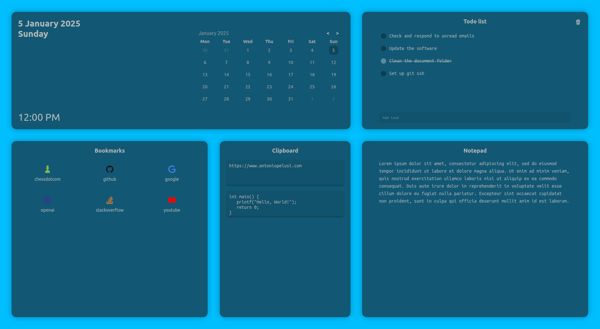

# ToolsTab

Minimal and responsive browser startpage with useful tools.

Real-time sync across all tabs using browser local storage.

Tools' status is saved in a persistent way.

## Install extension

Package for manual installation available at the [release page](https://github.com/antoniopelusi/ToolsTab/releases/).

## Tools and usage

- **Day/Time**: visualize day and time
- **Todo list**: manage tasks:
	- `Alt+click` on a todo list item: add/edit a bookmark:
    - When editing a todo list item, press `Enter` or click somewhere else to save it
    - When editing a todo list item, press `Escape` to abort the operation
    - When editing a todo list item, press `Delete` to delete it
  - `Ctrl+click` on a todo list item: delete it
- **Bookmarks**: 15 ordered bookmark slots:
  - `Alt+click` on a bookmark: add/edit a bookmark:
    - _name_: choose a service name (or one of the slug names from [`slugs.mg`](utils/slugs.md)) to automatically use the corresponding icon
    - _link_: the URL of the bookmark
    - When editing a bookmark, press `Enter` or click somewhere else to save it
    - When editing a bookmark, press `Escape` to abort the operation
    - When editing a bookmark, press `Delete` to delete it
  - `click` on a bookmark: open the link in this tab
  - `Ctrl+click` on a bookmark: open the link in a new tab
- **Clipboard**: 5 slots for copying and pasting texts
  - `Alt+click`: copy the slot content to the computer clipboard
  - `Ctrl+click`: empty the slot
- **Notepad**: Take notes
- **Dynamic background**: The background color changes automatically according to the day/night cycle
  - Enable/disable this feature from the extension popup menu
- **Configuration**:
	- `Ctrl+click` on the day/time tile: export the configuration to a file
  - `Alt+click` on the day/time tile: import a configuration from a file

## Screenshots

